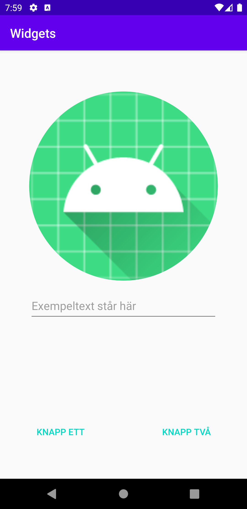

# Rapport
Först ändrade jag i xml filen activity main så att det blev linearlayout med en vertikal orientering med en padding för att ge lite rum åt innehållet.
```
<LinearLayout xmlns:android="http://schemas.android.com/apk/res/android"
    xmlns:app="http://schemas.android.com/apk/res-auto"
    xmlns:tools="http://schemas.android.com/tools"
    android:layout_width="match_parent"
    android:layout_height="match_parent"
    tools:context=".MainActivity"
    android:orientation="vertical"
    android:paddingVertical="50dp">
```
sen skapades en ImageView med ett id, samma bredd som min layout,300 enhets pixlar i höjd, en förklaring som hämtar texten på elementet med id:et a_logo från strings.xml och en sökväg till bilden som visas med srcCompat där det valdes en bild som redan fanns i projektet.
```
    <ImageView
        android:id="@+id/IviewID"
        android:layout_width="match_parent"
        android:layout_height="300dp"
        android:contentDescription="@string/a_logo"
        app:srcCompat="@mipmap/ic_launcher"
        android:layout_marginVertical="15dp" />
```
efter det skapades en EditText med ett id, en fst bredd och höjd, en börjartext som hämtas från ett element i string, en layout gravity för att centrera elementet på sidan och  en input type so.
```
    <EditText
        android:id="@+id/ETextID"
        android:layout_width="300dp"
        android:layout_height="50dp"
        android:hint="@string/exempeltext"
        android:layout_gravity="center"
        android:inputType="textAutoComplete" />
```
sedan skapades en nästad linearlayout medd horisontell orientering och i den lades två Button element som hade varsitt id, en fördefinerad styling, en bredd på 200 dp, samma höjd som layouten de ligger i och en text som hämtas från string.
```
    <LinearLayout
        android:layout_width="400dp"
        android:layout_height="wrap_content"
        android:orientation="horizontal"
        android:layout_gravity="center"
        android:layout_marginTop="150dp">

        <Button
            android:id="@+id/BtnID1"
            style="?android:attr/buttonBarButtonStyle"
            android:layout_width="200dp"
            android:layout_height="match_parent"
            android:text="@string/knapp_ett"
            android:layout_gravity="start"/>

        <Button
            android:id="@+id/BtnID2"
            style="?android:attr/buttonBarButtonStyle"
            android:layout_width="200dp"
            android:layout_height="match_parent"
            android:text="@string/knapp_2"
            android:layout_gravity="end" />

    </LinearLayout>

```

elementen flyttades med hjälp av margin, padding och gravity för att få det slutgiltiga utseendet.




